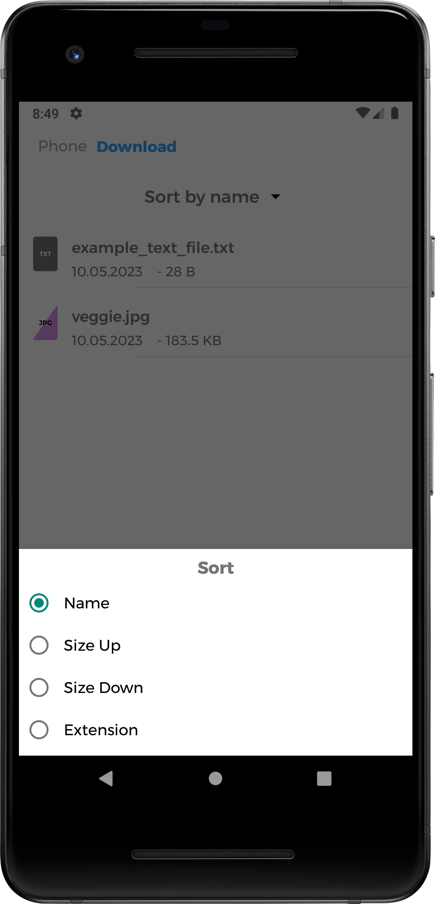

# File manager example app
File manager example app. Using Kotlin Flow, Navigation Component and Dagger2, etc.

## Description
An example app for getting list of files and directories on device was made as a test task for internship.

App is built according to the principles of <a href="https://blog.cleancoder.com/uncle-bob/2012/08/13/the-clean-architecture.html">Сlean architecture</a>.

MVVM is used as a design pattern.

## App features
User may:
* See device files and dirs list with its type, name, creation date and size
* Navigate between dirs by clicking on them or on dirs tree list
* Open files
* See modified files

## Sceenshots
 
 

